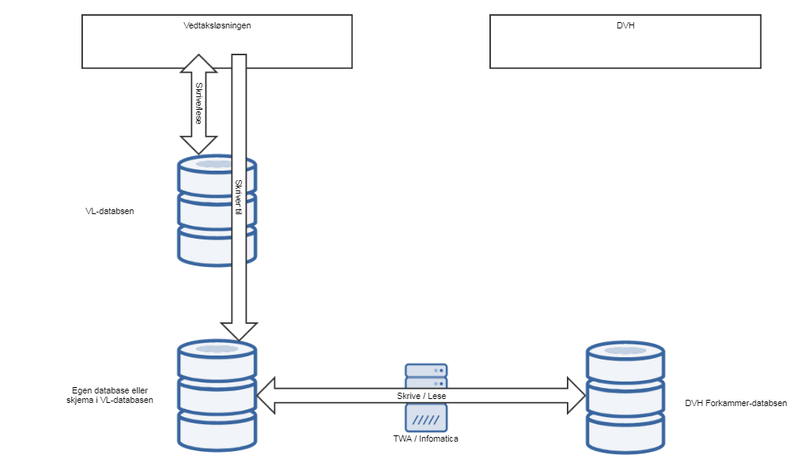

= Patterns

include::eksponerteTjenester.adoc[]

== Asynkron lesing fra meldingskø
Det er laget generell støtte for meldingsdrevne bønner. Selve konsumerings-loopen vises i diagrammet under.

image::https://confluence.adeo.no/rest/gliffy/1.0/embeddedDiagrams/eeb78adc-55eb-4a92-b49d-fe736360ad5f.png[Asynkron lesing fra meldingskø,opts=interactive,height=337,width=735]

Den abstrakte baseklassen QueueConsumerer midtpunktet i denne generelle støtten, og hver konkrete subklasse kan plugge inn sin egen:

* ConnectionFactory og Queue

    Dette er grunnleggende objekter som trengs for å bruke en meldingskø-server og en spesifik kø. Vil typisk slås opp fra JNDI.

* Sjekk av precondtion

    Typisk vil dette være en sjekk av at eksterne tjenester, database o.l. ikke er nede. Hensikten er å ikke lese meldinger fra kø når vi allerede vet at vi ikke kan håndtere dem. Da reduserer vi sjansen for å bruke opp det veldig begrensede antall leveringsforsøk som meldingskøen tilbyr for hver melding.

* Strategier for feilhåndtering

    Her kan man logge feil og vente (typisk i noen få sekunder) ved ulike feilsituasjoner.

* Håndtering av melding

    Den aktuelle funksjonaliteten som skal utføres for en melding,

* Strategi for commit og rollback av melding

    Her kan man velge mellom de ulike JMS session modes. Baseklassen kommer med en "client acknowledge mode" strategi valgt som default.

Hvis en melding avvises med rollback et visst antall ganger (default 3, men konfigurerbart opp til 10 i Fasit), vil meldingskø-serveren gi opp å levere den, og legge den på backout-kø.

Start og stopp av konsumerings-loopen trigges av klassen AsyncJmsConsumerStarter, som er knyttet til start og stopp av web-applikasjonen. Alle CDI bønner som arver fra QueueConsumerblir startet/stoppet.

== Integrasjon mot Datavarehus
Vedtaksløsningens integrasjon mot NAVs Datavarehus er implementert ved et separat mellomlager-skjema i VL-databasen. VL har fått satt opp skrivetilgang til dette skjemaet, og lagring til det foregår synkront. DVH-bruker er satt opp med leserettigheter. Hver gang en fagsak, behandling o.l. endrer status i VL vil det skrives en tilsvarende rad i mellomlager-databasen.

Overordnet ser arkitekturen slik ut:

